# 🔍 DevOps 06 – Quality Tests & Codeanalyse

## 👥 Zusammenarbeit

### 📄 Person und Repository

|                          |                                                                                              |
|--------------------------|----------------------------------------------------------------------------------------------|
| Bearbeiter               | Alessio Pugliese                                                                             |
| Repository               | [DevOps-06-Quality-test](https://github.com/pugliale/DevOps-06-Quality-test)                |

---

## 💻 Verwendete Systeme & Tools

| Tool / Technologie     | Beschreibung                                                                                   |
|------------------------|-----------------------------------------------------------------------------------------------|
| **Gradle**             | Build Tool inkl. Test- und SonarQube-Integration                                              |
| **JaCoCo**             | Test Coverage Tool für Java-Projekte                                                          |
| **ESLint**             | Linter für JavaScript/TypeScript-Code im Frontend                                             |
| **SonarQube**          | Plattform zur statischen Codeanalyse und Qualitätssicherung                                   |
| **Selenium IDE**       | Tool für Integrationstests mit UI-Interaktion über Browser-Automation                         |
| **Visual Studio Code** | Entwicklungsumgebung mit Linting- und Testintegration                                         |
| **Git & GitHub**       | Versionierung und Quellcodeverwaltung                                                         |

---

## 📖 Theoretischer Hintergrund

### 🎯 Codequalität – Warum wichtig?

Gute Codequalität erhöht:
- die **Lesbarkeit**,
- die **Fehlertoleranz**,
- die **Wartbarkeit** und
- die **Nachvollziehbarkeit** von Softwareprojekten.

Gerade im DevOps-Kontext, in dem kontinuierlich entwickelt und ausgeliefert wird, ist Qualitätssicherung essenziell, um technische Schulden zu vermeiden.

---

### 🔧 Linting (ESLint)

Linting bezeichnet die statische Analyse von Quellcode, um stilistische oder logische Fehler frühzeitig zu erkennen – noch **vor dem Kompilieren oder Ausführen**.

**ESLint** ist ein Linter speziell für JavaScript/TypeScript, der Regeln prüft wie:
- unbenutzte Variablen
- falsche Einrückungen
- fehlende Semikolons
- fehlerhafte Syntax

Linter wie ESLint erhöhen die **Disziplin im Code-Stil** und verhindern viele banale Fehler.

---

### 🧪 Blackbox-Tests mit Selenium

**Selenium IDE** ermöglicht automatisierte Tests direkt im Browser. Dabei werden:
- Interaktionen mit der Benutzeroberfläche aufgezeichnet
- Tastatureingaben und Mausklicks simuliert
- Textüberprüfungen durchgeführt

Selenium eignet sich besonders für **Integrationstests**, die das Gesamtsystem über die UI prüfen. Dabei wird nicht der Quellcode analysiert, sondern nur das Verhalten von außen (Blackbox).

---

### 🧠 SonarQube – Codeanalyse & Qualitätssicherung

**SonarQube** analysiert den Quellcode auf verschiedene Metriken und Fehlerarten:

| Kategorie         | Beispiel                                                           |
|-------------------|--------------------------------------------------------------------|
| Bugs              | Fehlerhafte Implementierungen (z. B. NullPointer, falsche Bedingungen) |
| Code Smells       | Schlechter Stil, unnötige Komplexität                             |
| Security Hotspots | Kritische Stellen mit potenziellem Sicherheitsrisiko              |
| Duplications      | Redundanter Code                                                   |
| Coverage          | Wie viel Code durch Tests abgedeckt ist                           |
| Maintainability   | Verständlichkeit und Wartbarkeit                                   |

---

## 🔧 Praktische Umsetzung

### 🧪 JaCoCo Coverage Report (Backend)

1. Gradle `test`-Task ausgeführt, um JaCoCo-Coverage zu erzeugen  
2. Automatisch HTML-Report erstellt  
3. Öffnung der HTML-Auswertung im Browser

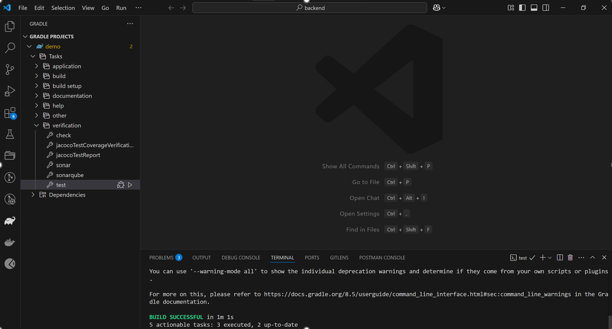
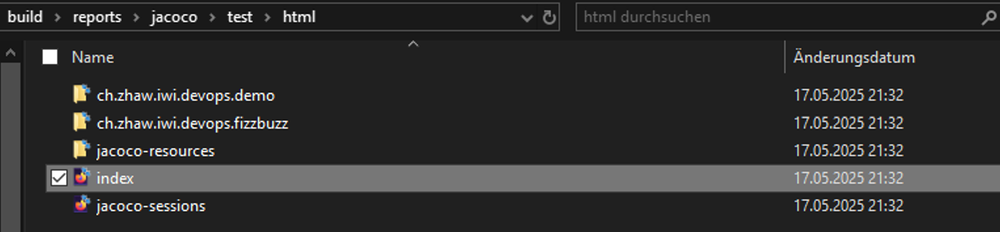
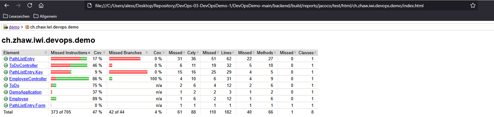

---

### 🧹 Linting mit ESLint (Frontend)

1. ESLint im `frontend`-Verzeichnis initialisiert  
2. Erweiterung in VS Code installiert  
3. Erste Lint-Prüfung ohne Fehler

```bash
npx eslint .
```

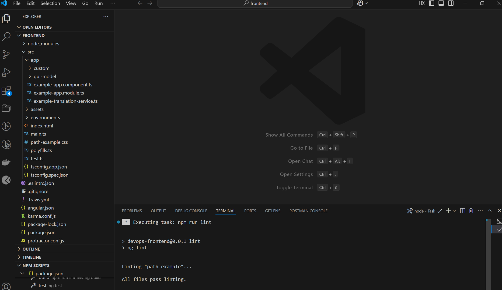

4. Fehler gezielt eingebaut → ESLint erkennt und meldet sie  
5. Fehlermeldungen in VS Code hervorgehoben

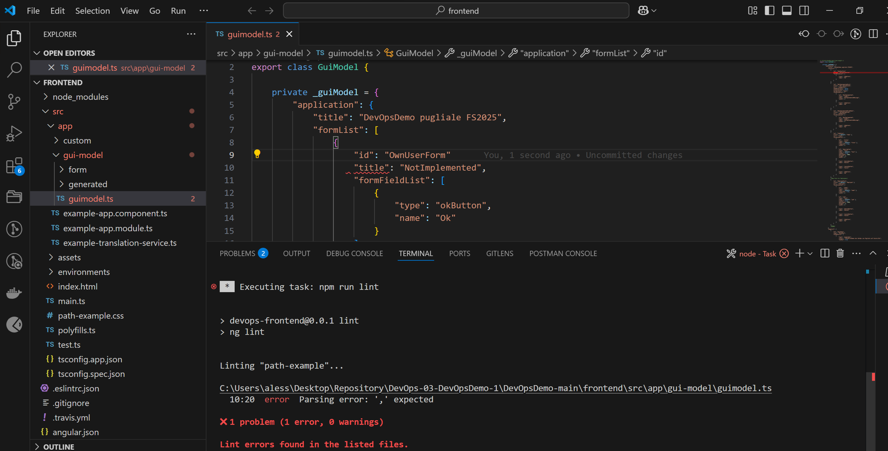
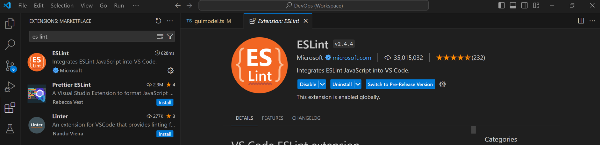

---

### 🔍 SonarQube Analyse – Backend

1. Sonar-Projekt `DevOpsDemo-Backend` angelegt  
2. Analyse via:

```bash
./gradlew sonar \
  -Dsonar.projectKey=DevOpsDemo-Backend \
  -Dsonar.projectName='DevOpsDemo-Backend' \
  -Dsonar.host.url=http://localhost:9000 \
  -Dsonar.token=<TOKEN>
```

3. Dashboard geöffnet und Bewertung geprüft

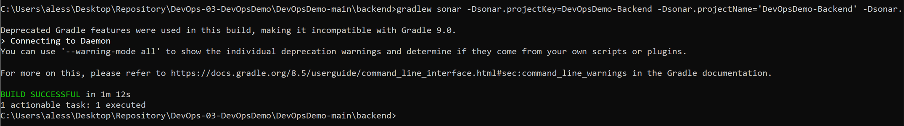
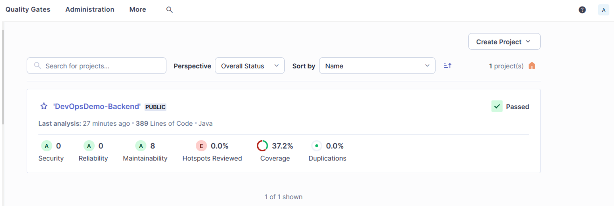
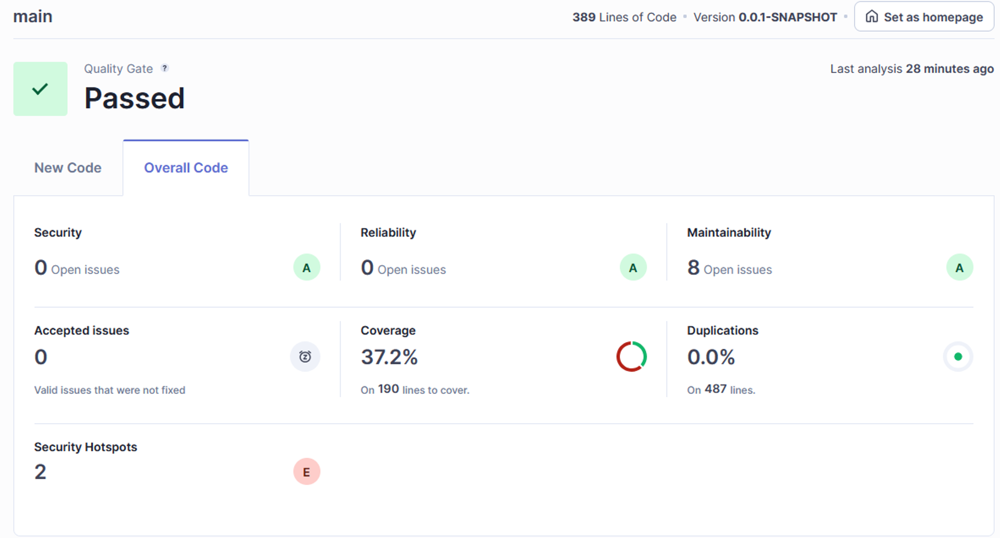
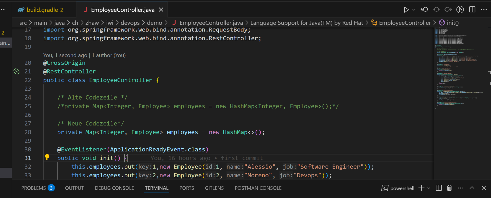

4. Fehlerhafte Version gezielt gesucht und analysiert  
5. Detaillierte Fehleranzeige auf Klassenebene

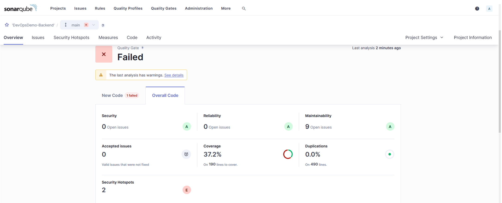
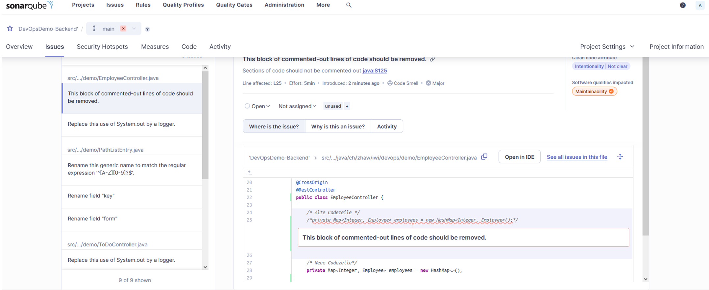

---

### 🔍 SonarQube Analyse – Frontend

1. Projekt `DevOpsDemo-Frontend` angelegt  
2. Analyse via:

```bash
npx sonar-scanner \
  -Dsonar.host.url=http://localhost:9000 \
  -Dsonar.projectKey=DevOpsDemo-Frontend \
  -Dsonar.projectName='DevOpsDemo-Frontend' \
  -Dsonar.token=<TOKEN>
```

3. Ergebnisanzeige im Webinterface

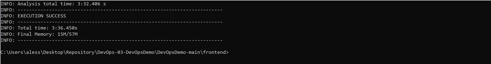
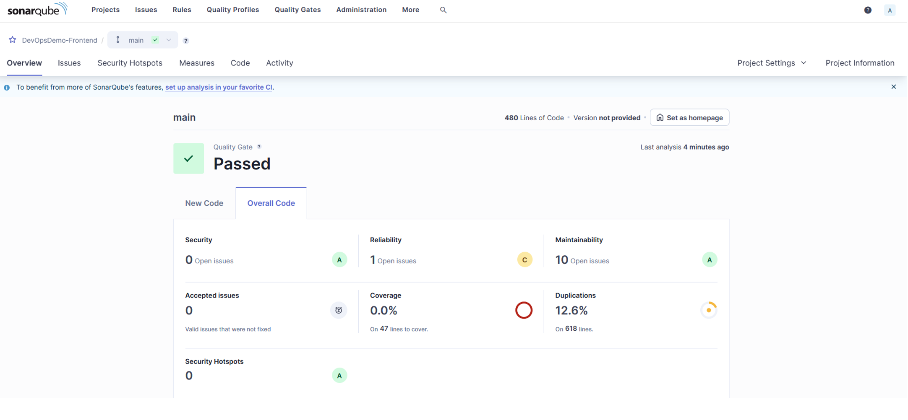

---

### 🧪 Integrationstests mit Selenium IDE

1. Neues Projekt in Selenium IDE erstellt  
2. Navigation auf [digitec.ch](https://www.digitec.ch)  
3. Im Suchfeld nach „ipad“ gesucht  
4. Prüfung mit `verifyText` und später `assertText`  
5. Demonstration von Test-Fails bei falscher Schreibweise

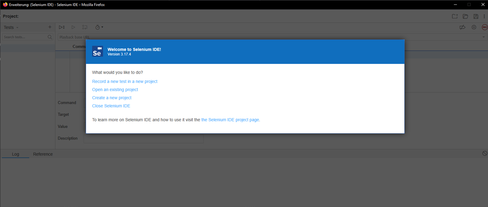
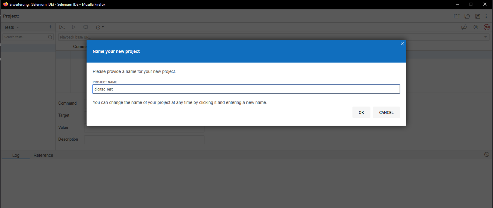
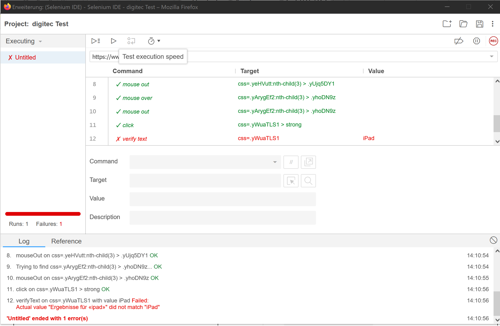
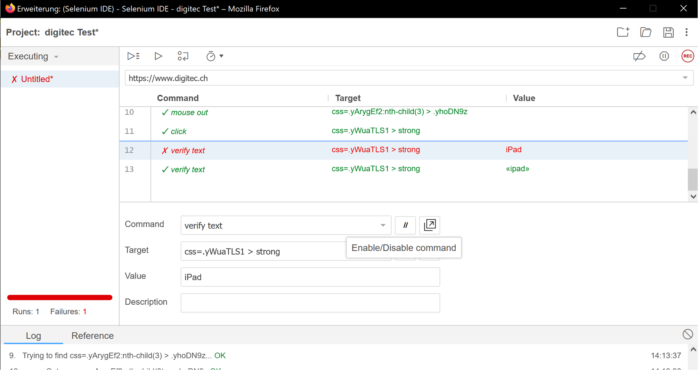
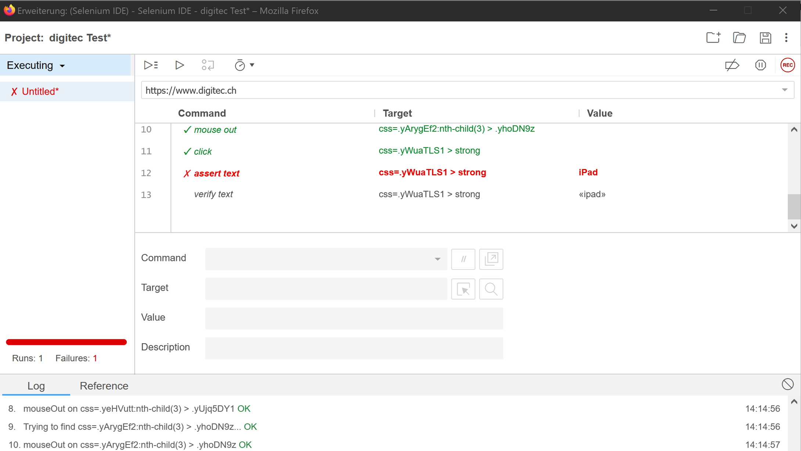

---

## 🧠 Erkenntnisse und Fazit

### 📌 Fachlich gelernt

- **Linting mit ESLint** zeigte, wie effektiv kleine Codeprobleme vorab erkannt werden können
- **SonarQube** ist ein sehr mächtiges Werkzeug zur Analyse technischer Schulden und bietet konkrete Handlungsempfehlungen
- Durch **Selenium IDE** wurde die Anwendung nicht nur getestet, sondern echte UI-Interaktionen automatisiert überprüft
- Durch die Kombination der Tools entsteht ein ganzheitliches Bild der Codequalität (Stil, Sicherheit, Verhalten, Testabdeckung)

### 💬 Persönliche Reflexion

Ich sehe nun klarer, wie Qualitätssicherung als **kontinuierlicher Bestandteil** moderner Softwareentwicklung funktioniert. Besonders SonarQube hat mich beeindruckt – es zeigt in Echtzeit, wie sich Änderungen auf die Gesamtqualität auswirken. Zusammen mit ESLint und Selenium ergibt sich ein Toolset, das sowohl auf Codeebene als auch aus Benutzersicht die Qualität prüft.

> 🧠 *„DevOps ohne Qualitätssicherung ist wie Deployment ohne Ziel – schnell, aber riskant.“*

---

📅 *Frühjahrssemester 2025 – ZHAW School of Management and Law*
